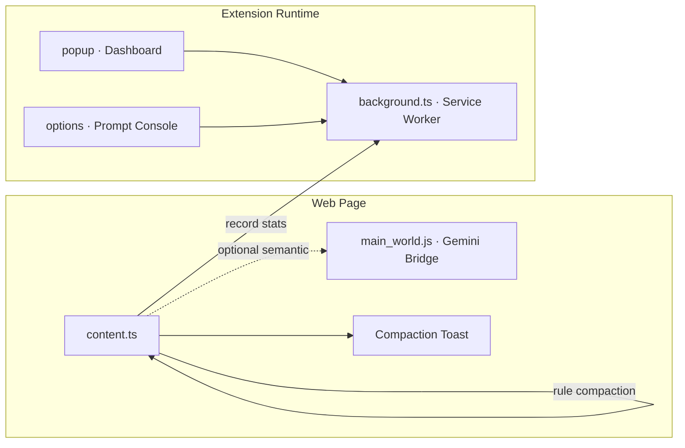

# SynapseClean

**Local context compactor and semantic prompt cleaner for AI power-users.**

> Part of the [synapseclean-project](../) monorepo (`synapseclean` + `synapseclean-web`). No backend package — 100% client-side.

SynapseClean is an open-source Chrome extension that intercepts messy webpage copy and compacts it into clean, paste-ready prompts before it reaches your clipboard or AI chat. All compaction runs on-device. There are no accounts, no payments, and no telemetry.

<p align="center">
  
</p>

<p align="center">
  <a href="LICENSE"></a>
  <a href="https://github.com/fujiDevv/synapseclean"></a>
  <a href="https://www.typescriptlang.org/"></a>
  <a href="https://developer.chrome.com/docs/extensions/mv3/"></a>
  <a href="https://vitejs.dev/"></a>
  <a href="https://bun.sh/"></a>
</p>

<p align="center">
  
  
  
  
</p>

---

## Overview

Researchers and power-users routinely copy thousands of words from the web into Claude, ChatGPT, Gemini, and other cloud LLMs. Raw webpage paste carries navigation chrome, cookie banners, ads, and invisible formatting that wastes context windows and premium message quotas.

SynapseClean adds a local compaction layer at copy time:

1. Intercepts large text selections via copy events, keyboard shortcut, or context menu
2. Strips boilerplate with a fast rule-based engine
3. Optionally refines output with Gemini Nano semantic compaction (Chrome Prompt API)
4. Writes a clean Markdown outline back to the clipboard

---

## Key Features

| Capability | Description |
|------------|-------------|
| **Auto-compact on copy** | Intercepts clipboard when a selection meets the minimum character threshold |
| **Rule-based compaction** | Removes nav crumbs, cookie banners, ads, and duplicate whitespace |
| **Gemini Nano semantic cleaning** | Optional on-device AI refinement via Chrome Prompt API |
| **Keyboard shortcut** | `Alt+Shift+C` (Mac: Option+Shift+C) on any selection |
| **Context menu** | Right-click selection, then "SynapseClean: Compact for AI" |
| **Output formats** | Markdown, outline, or bullets |
| **Prompt Console** | Full-page options UI for policy, thresholds, and usage metrics |
| **Local usage log** | Compaction counts and characters saved — stored only on your device |

---

## Architecture



### Compaction pipeline

| Stage | Engine | Description |
|-------|--------|-------------|
| 1 | HTML-to-Markdown | Preserves structure from DOM selection |
| 2 | Rule strip | Removes boilerplate, deduplicates lines, applies format |
| 3 | Gemini Nano | Optional semantic refinement when enabled and available |

---

## Requirements

| Requirement | Notes |
|-------------|-------|
| Google Chrome or Chromium | 127+ recommended for Gemini Nano |
| [Bun](https://bun.sh/) | 1.1+ for development |

Gemini Nano is optional. Rule-based compaction works on every supported Chrome install without on-device AI.

---

## Installation

### From source (development)

```bash
git clone https://github.com/fujiDevv/synapseclean.git
cd synapseclean
bun install
bun run build
```

Load the unpacked extension:

1. Open `chrome://extensions`
2. Enable **Developer mode**
3. Click **Load unpacked**
4. Select the `dist/` directory

### First run

On first install, the Prompt Console opens automatically. Configure auto-compact, minimum character threshold, output format, and Gemini Nano from there.

---

## Usage

### Quick start

1. Select text on any webpage (must meet your minimum character threshold — default 200).
2. Copy or compact using one of the triggers below.
3. Paste the cleaned Markdown into your AI chat.

### Triggers

| Action | Windows / Linux | macOS |
|--------|-----------------|-------|
| **Auto-compact on copy** | Select text → `Ctrl+C` | Select text → `Cmd+C` |
| **Manual compact** | Select text → `Alt+Shift+C` | Select text → `Option+Shift+C` |
| **Context menu** | Right-click selection → **SynapseClean: Compact for AI** | Same |
| **Settings** | Extension popup → **Prompt Console** | Same |

Chrome maps `Alt+Shift+C` to `⌥⇧C` on Mac automatically. To remap the shortcut, open [`chrome://extensions/shortcuts`](chrome://extensions/shortcuts) and edit **SynapseClean → Compact selected text for AI prompts**.

### In-app guide

Open the **Prompt Console** (options page) and switch to the **How to Use** tab for shortcuts, tips, and workflow details. On first install, that guide opens automatically.

### Support the project

SynapseClean is free and open-source. If it saves you context windows, you can support development on [Ko-fi](https://ko-fi.com/D6M821E6GR) — linked from the extension popup and Prompt Console **Support** tab.

---

## Development

```bash
bun install          # install dependencies
bun run dev          # watch build (reload dist/ in chrome://extensions)
bun run build        # production build to dist/
bun run test         # Vitest unit tests
bun run test:e2e     # Playwright extension e2e tests
bun run verify       # type-check + unit tests
bun run logos        # regenerate PNG logos (requires Python 3 + Pillow)
```

### Project structure

```
synapseclean/
├── background.ts          # Service worker, stats, message routing
├── content.ts             # Copy intercept, compaction orchestration
├── main_world.ts          # Gemini Nano bridge (page context)
├── popup/                 # Extension popup UI
├── options/               # Prompt Console (full-page settings)
├── src/
│   ├── compactor.ts       # Rule-based compaction engine
│   ├── ai.ts              # Gemini Nano integration
│   ├── html-to-markdown.ts
│   ├── overlay.ts         # Toast notifications
│   └── manifest.json
└── assets/                # Icons and noise texture
```

---

## Privacy

SynapseClean processes text locally and makes no network requests for compaction, licensing, or telemetry. See [PRIVACY.md](PRIVACY.md) for the full policy.

---

## Contributing

Bug reports, feature requests, and pull requests are welcome. Read [CONTRIBUTING.md](CONTRIBUTING.md) for setup, coding standards, and PR guidelines.

---

## Security

Report vulnerabilities responsibly to **fujidevv@duck.com** with subject line `Security Report — synapseclean`. Include reproduction steps and affected versions.

---

## License

[MIT License](LICENSE) — Copyright (c) 2026 FujiDevv

---

## Links

| Resource | URL |
|----------|-----|
| Repository | https://github.com/fujiDevv/synapseclean |
| Issues | https://github.com/fujiDevv/synapseclean/issues |
| Maintainer | fujidevv@duck.com |